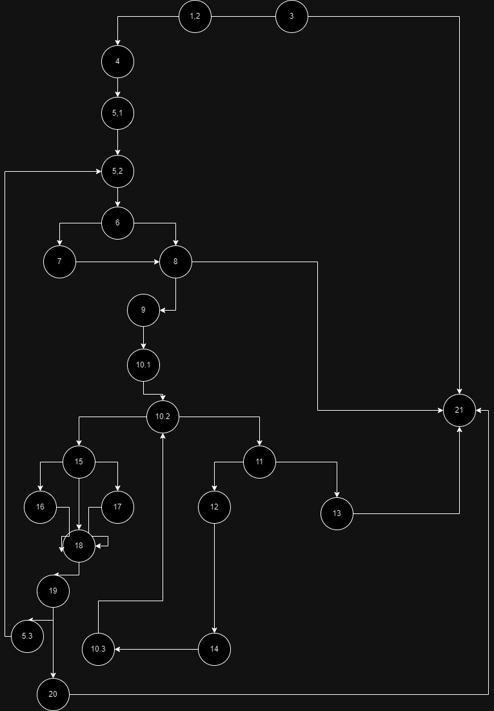

Втора лабораториска вежба по Софтверско инженерство
Стефан Стојановски, бр. на индекс 226067

2.Control Flow Graph

3.Цикломатска комплексност 

Цикломатската комплексност е 10, ја добив така што ги 
изброив предикатните јазли и додадов +1 (P+1 формула),
исто така се добива истиот резултат доколку ги изброите регионите на CFG

4.Tест примери според Every Branch:

allItems = null, payment = x; Ова го покрива условот каде што се 
исврла исклучок дека листата е празна

items{null,"12345",100,0} ; pay=100 Ова гледа да се покрие 
item.setName("unknown");

items{"item1",null,100,0} ; pay=150 Ова го покрива исклучокот No "barcode!"

items{"Item1","1a2v3",100,0} ; pay=150 Ова го покрива исклучокот 
"Invalid character in item barcode!"

items{"Item1", "12345", 100, 0.2f} ; pay=20 Ова гледа да се изврши кодот 
sum += item.getPrice() * item.getDiscount();

items{"Item1", "12345", 100, 0} ; pay=100 Ова гледа да се изврши кодот
sum -= 30;

items{"Item1", "012345", 400, 0.1f} ; pay=370 Ова го гледа да се врати True 
како резултат

5.Напишете ги сите тест случаи според Multiple Condition

allItems = {"Item1", "012345", 350, 0.1f} Каде сите тест случаи се вистинити

allItems = {"Item1", "012345", 300, 0.1f} Каде само item.getPrice е неточно

allItems = {"Item1", "012345", 350, 0f} пример каде само
 item.getDiscount е неточно 

allItems = {"Item1", "12345", 350, 0.1f} каде само item.getBarcode().charAt(0) == '0' е неточно

allItems = {"Item1", "012345", 300, 0f} каде item.getPrice и item.getDiscount се неточни

allItems = {"Item1", "12345", 300, 0.1f} каде 
item.getPrice и item.getBarcode().charAt(0) == '0' се неточни

allItems = {"Item1", "12345", 350, 0f}  каде item.getDiscount и item.getBarcode().charAt(0) == '0' се неточни

allITems = {"Item1", "12345", 300, 0f} каде сите услови се неточни
